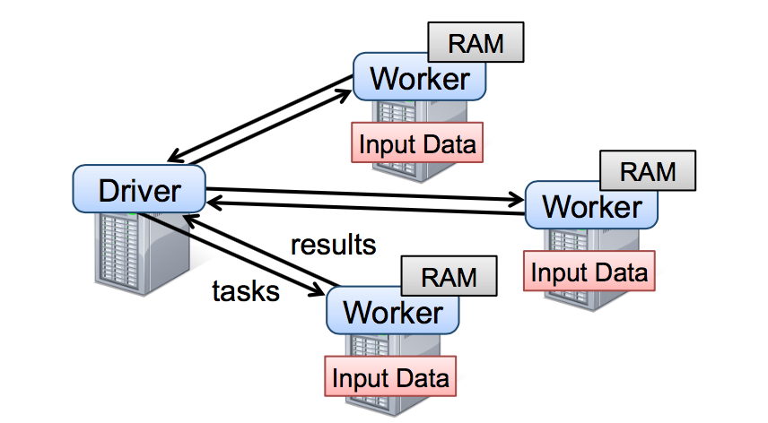
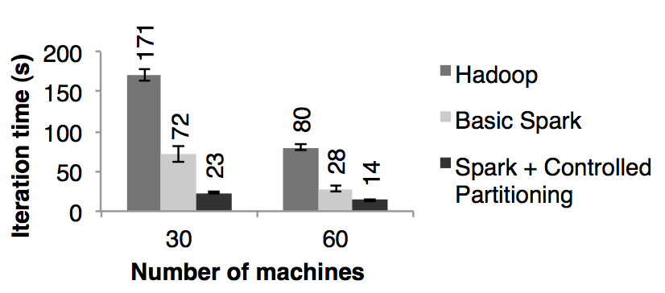

# Spark RDD（Resilient Distributed Datasets）论文

*   [概要](#概要)
*   [1：介绍](#1-介绍)
*   [2：Resilient Distributed Datasets（RDDs）](#2-resilient-distributed-datasetsrdds)
    *   [2.1 RDD 抽象](#21-rdd-抽象)
    *   [2.2 Spark 编程接口](#22-spark-编程接口)
        *   [2.2.1 例子 – 监控日志数据挖掘](#221-例子--监控日志数据挖掘)
    *   [2.3 RDD 模型的优势](#23-rdd-模型的优势)
    *   [2.4 不适合用 RDDs 的应用](#24-不适合用-rdds-的应用)
*   [3 Spark 编程接口](#3-spark-编程接口)
    *   [3.1 Spark 中 RDD 的操作](#31-spark-中-rdd-的操作)
    *   [3.2 举例应用](#32-举例应用)
        *   [3.2.1 线性回归](#321-线性回归)
        *   [3.2.2 PageRank](#322-pagerank)
*   [4 表达 RDDs](#4-表达-rdds)
*   [5 实现](#5-实现)
    *   [5.1 job 调度器](#51-job-调度器)
    *   [5.2 集成解释器](#52-集成解释器)
    *   [5.3 内存管理](#53-内存管理)
    *   [5.4 对 Checkpointing 的支持](#54-对-checkpointing-的支持)
    *   [6 评估](#6-评估)
    *   [6.1 迭代式机器学习应用](#61-迭代式机器学习应用)
    *   [6.2 PageRank](#62-pagerank)
    *   [6.3 容错](#63-容错)
    *   [6.4 内存不足的行为](#64-内存不足的行为)
    *   [6.5 用 spark 构建的用户应用](#65-用-spark-构建的用户应用)
    *   [6.6 交互性的数据挖掘](#66-交互性的数据挖掘)
*   [7 讨论](#7-讨论)
    *   [7.1 已经存在的编程模型的表达](#71-已经存在的编程模型的表达)
    *   [7.2 利用 RDDs 来 debug](#72-利用-rdds-来-debug)
*   [8 相关工作](#8-相关工作)
*   [9 结尾](#9-结尾)
*   [鸣谢](#鸣谢)
*   [引用资料](#引用资料)
*   [原文链接](#原文链接)
*   [贡献者](#贡献者)

## 概要

为了能解决程序员能在大规模的集群中以一种容错的方式进行内存计算这个问题，我们提出了 RDDs 的概念。当前的很多框架对迭代式算法场景与交互性数据挖掘场景的处理性能非常差，这个是 RDDs 的提出的动机。如果能将数据保存在内存中，将会使的上面两种场景的性能提高一个数量级。为了能达到高效的容错，RDDs 提供了一种受限制的共享内存的方式，这种方式是基于粗粒度的转换共享状态而非细粒度的更新共享状态。然而，我们分析表明 RDDs 可以表达出很多种类的计算，包括目前专门从事迭代任务的编程计算模型，比如 Pregel，当然也可以表达出目前模型表达不出的计算。我们通过 Spark 系统来实现了 RDDs，并且通过各种各样的用户应用和测试来评估了这个系统。

## 1：介绍

像 MapReduce 和 Dryad 等分布式计算框架已经广泛应用于大数据集的分析。这些系统可以让用户不用担心分布式工作以及容错，而是使用一系列的高层次的操作 api 来达到并行计算的目的。

虽然当前的框架提供了大量的对访问利用计算资源的抽象，但是它们缺少了对利用分布式内存的抽象。样使的它们在处理需要在多个计算之间复用中间结果的应用的时候会非常的不高效。数据的复用在迭代机器学习和图计算领域（比如 PageRank，K-means 以及线性回归等算法）是很常见的。在交互式数据挖掘中，一个用户会经常对一个相同的数据子集进行多次不同的特定查询，所以数据复用在交互式数据挖掘也是很常见的。然而，目前的大部分的框架对计算之间的数据复用的处理方式就是将中间数据写到一个靠稳定的系统中（比如分布式文件系统），这样会由于数据的复制备份，磁盘的 I/O 以及数据的序列化而致应用任务执行很费时间。

认识到这个问题后，研究者们已经为一些需要中间数据复用的应用开发出了一些特殊的框架。比如Pregel 在做迭代式图计算的时候会将中间结果放在内存中。HaLoop 也提供了迭代式 MapReduce 接口。然而，这些框架仅仅支持一些特殊的计算模式（比如循环一系列的 MapReduce 步骤），并且它们是隐式的为些计算模式提供数据共享。它们没有提供更加普遍数据复用的抽象，比如可以让用户加载几个数据集到存中然后对这些内存中的数据集进行专门的查询。

在这篇论文中，我们提出了一个全新的抽象，叫做 RDDs，它可以高效的处理广泛的应用中涉及到的数据用的场景。RDDs 是一个可以容错且并行的数据结构，它可以让用户显式的将中间结果数据集保存在内中、控制数据集的分区来达到数据存放处理最优以及可以使用丰富的操作 api 来操作数据集。

在设计 RDDs 的时候，最大的挑战是定义一个可以高效容错的编程接口。已经存在的分布式内存抽象系统比如 distributed shared memory、key-value stores、databases 以及 Poccolo，都是提供了基于粒度的更新可变状态（比如 table 中的 cells）的接口，基于这种接口下，保证容错的方式无非是将数据复备份到多台机器或者在多台机器上记录更新的日志，这两种方式在数据密集性的工作任务中都是非常的耗时的，因为需要通过网络传输在机器节点间复制大量的数据，宽带传输数据的速度远远比 RAM 内存慢，而这两种方式会占用大量的存储空间。

与这些系统相反，RDDs 提供了基于粗粒度转换（比如 map，filter 以及 join）的接口，这些接口可以对多的数据条目应用相同的操作。这样就可以通过记录来生成某个数据集的一系列转换（就是这个数据集 lineage）而不是记录真实的数据来达到提供高效的容错机制。这个 RDD 就有足够的信息知道它是从哪 RDDs 转换计算来的，如果一个 RDD 的分区数据丢失掉了，那么重新计算这个 RDD 所依赖的那个 RDD 对应的区就行了。因此可以很快且不用通过复制备份方式来恢复丢失的数据。

虽然基于粗粒度的转换一开始看起来受限制，但是 RDDs 非常适合很多并行计算的应用，因为这些应用基都是在大量的数据元素上应用相同的操作方法。事实上，我们分析表明 RDDs 不仅可以高效的表达出目前括 MapReduce，DryadLINQ，SQL，Pregel 以及 HaLoop 等系统提出的分布式编程模型，而且还能表达它们表达不了的新的应用的计算模型，比如交互型数据挖掘。我们相信，RDDs 解决那些新的框架提出来计算需求的能力将会成为是 RDD 抽象强大的最有力证据。

我们在 Spark 系统中实现了 RDDs，这个系统已经在 UC Berkeley 以及好些个公司中应用于研究和生产应中。Spark 和 DryadLINQ 类似使用scala语言提供了很方便语言集成编程接口。另外，Spark可以利用 scala 的解释器来对大数据集进行交互式的查询。我们相信 spark 是首个允许使用多种编程语言来进行分布式内存中交互式数据挖掘的系统。

我们通过为基准测试以及用户应用的测试两个方面来评估了 RDDs 和 spark。我们分析显示，Spark 在迭代应用中可以比 hadoop 快上 20 倍以上、使的现实中的数据分析报表的速度提升了 40 倍以及使的交互式的扫1TB数据集的延迟在 5-7 秒。更重要的是，为了彰显 RDDs 的普遍性，我们基于spark 用相对较小的程序（每个包只有 200 行代码）实现了 Pregel 和 HaLoop 的编程模型，包括它们使用的数据分布优化。本篇论文以 RDDs（第二节）和 Spark（第三节）的概述开始。然后在第四节中讨论 了RDD s内部的表达、在第节中讨论了我们的实现以及在第六节中讨论了实验结果。最后，我们讨论了 RDDs 是怎么样来表达现在已存在的几个系统的编程模型（第七节）、调查相关工作（第八节）以及总结。

## 2：Resilient Distributed Datasets（RDDs）

这节主要讲述 RDDs 的概要，首先定义 RDDs（2.1）以及介绍 RDDs 在 spark 中的编程接口（2.2），然后对 RDDs 和细粒度共享内存抽象进行的对比（2.3）。最后我们讨论了 RDD 模型的限制性。

### 2.1 RDD 抽象

一个 RDD 是一个只读，被分区的数据集。我们可以通过两种对稳定的存储系统和其他的 RDDs 进行操作而创建一个新的 RDDs。为了区别开 RDDs 的其他操作，我们称这些操作为 transformations，比如 map，filter 以及 join 等都是 transformations 操作。

RDDs 并不要始终被具体化，一个 RDD 有足够的信息知道自己是从哪个数据集计算而来的（就是所谓的依赖血统），这是一个非常强大的属性：其实，一个程序你能引用一个不能从失败中重新构建的 RDD。

最后，用户可以控制 RDDs 的两个方面：数据存储和分区。对于需要复用的 RDD，用户可以明确的选择一个数据存储策略（比如内存缓存）。他们也可以基于一个元素的 key 来为 RDD 所有的元素在机器节点间进行数据分区，这样非常利于数据分布优化，比如给两个数据集进行相同的 hash 分区，然后进行 join，可以提高 join 的性能。

### 2.2 Spark 编程接口

Spark 和 DryadLINQ 和 FlumeJava 一样通过集成编程语言 api 来暴露 RDDs，这样的话，每一个数据集就代表一个对象，我们可以调用这个对象中的方法来操作这个对象。

编程者可以通过对稳定存储的数据进行转换操作（即 transformations，比如 map 和 filter 等）来得到一个或者多个 RDDs。然后可以对这些 RDDs 进行 actions 操作，这些操作可以是得到应用的结果值，也可以是将结果数据写入到存储系统中，actions 包括：count（表示返回这个数据集的元素的个数）、collect（表示返回数据集的所有元素）以及 save（表示将输出结果写入到存储系统中）。和 DryadLINQ 一样，spark 在定义 RDDs 的时候并不会真正的计算，而是要等到对这个 RDDs 触发了 actions 操作才会真正的触发计算，这个称之为 RDDs 的 lazy 特性，所以我们可以先对 transformations 进行组装一系列的 pipelines，然后再计算。

另外，编程者可以通过调用 RDDs 的 persist 方法来缓存后续需要复用的 RDDs。Spark 默认是将缓存数据放在内存中，但是如果内存不足的话则会写入到磁盘中。用户可以通过 persist 的参数来调整缓存策略，比如只将数据存储在磁盘中或者复制备份数据到多台机器。最后，用户可以为每一个 RDDs 的缓存设置优先级，以达到哪个在内存中的 RDDs 应该首先写道磁盘中

#### 2.2.1 例子 – 监控日志数据挖掘

假设一个 web 服务正发生了大量的错误，然后运维人员想从存储在 hdfs 中的几 TB 的日志中找出错误的原因。运维人员可以通过 spark 将日志中的错误信息加载到分布式的内存中，然后对这些内存中的数据进行查询。她首先需要写下面的 scala 代码:

```
line = spark.textFile("hdfs://..")
errors = lines.filter(_.startsWith("ERROR"))
errors.persist() 
```

第一行表示从一个 HDFS 文件（许多行的文件数据集）上定义了一个 RDD，第二行表示基于前面定义的 RDD 进行过滤数据。第三行将过滤后的 RDD 结果存储在内存中，以达到多个对这个共享 RDD 的查询。需要注意的事，filter 的参数是 scala 语法中的闭包。

到目前为止，集群上还没有真正的触发计算。然而，用户可以对RDD进行action操作，比如对错误信息的计数:

```
errors.count()
```

用户也可以继续对 RDD 进行 transformations 操作，然后计算其结果，比如:

```
//对错误中含有 ”MySQL” 单词的数据进行计数
errors.filters(_.contains("MySQL")).count()

//返回错误信息中含有 "HDFS" 字样的信息中的时间字段的值（假设每行数据的字段是以 tab 来切分的，时间字段是第 3 个字段）
errors.filter(_.contains("HDFS"))
        .map(_.split("\t")(3))
        .collect()
```

在对 errors 第一次做 action 操作的后，spark 会将 errors 的所有分区的数据存储在内存中，这样后面对 errors 的计算速度会有很大的提升。需要注意的是，像 lines 这种基础数据的 RDD 是不会存储在内存中的。因为包含错误信息的数据可能只是整个日志数据的一小部分，所以将包含错误数据的日志放在内存中是比较合理的。

最后，为了说明我们的模型是如何达到容错的，我们在图一种展示了第三个查询的血缘关系图（lineage graph）。在这个查询种，我们以对 lines 进行过滤后的 errors 开始，然后在对 errors 进行了 filter 和 map 操作，最后做了 action 操作即 collect。Spark 会最后两个 transformations 组成一个 pipeline，然后将这个 pipeline 分解成一系列的 task，最后将这些 task 调度到含有 errors 缓存数据的机器上进行执行。此外，如果 errors 的一个分区的数据丢失了，spark 会对 lines 的相对应的分区应用 filter 函数来重新创建 errors 这个分区的数据


图一：我们例子中第三个查询的血缘关系图，其中方框表示 RDDs，箭头表示转换

### 2.3 RDD 模型的优势

为了理解作为分布式内存抽象的 RDDs 的好处，我们在表一中用 RDDs 和分布式共享内存系统（Distributed shared memory 即 DSM）进行了对比。在所有的 DSM 系统中，应用从一个全局的地址空间中的任意位置中读写数据。需要注意的是，依据这个定义，我们所说的 DSM 系统不仅包含了传统的共享内存系统，还包含了对共享状态的细粒度写操作的其他系统（比如 Piccolo），以及分布式数据库。DSM 是一个很普遍的抽象，但是这个普遍性使得它在商用集群中实现高效且容错的系统比较困难。

| Aspect（概念）| RDDs | Distribute shared memory（分布式共享内存）|
| --- | --- | --- |
| Reads | 粗粒度或者细粒度 | 细粒度 |
| Writes | 粗粒度 | 细粒度 |
| 数据一致性 | 不重要的（因为RDD是不可变的）| 取决于app 或者 runtime |
| 容错 | 利用lineage达到细粒度且低延迟的容错 | 需要应用checkpoints（就是需要写磁盘）并且需要程序回滚 |
| 计算慢的任务 | 可以利用备份的任务来解决 | 很难做到 |
| 计算数据的位置 | 自动的机遇数据本地性 | 取决于app（runtime是以透明为目标的）|
| 内存不足时的行为 | 和已经存在的数据流处理系统一样，写磁盘 | 非常糟糕的性能（需要内存的交换？）|

表一：RDDs 和 Distributed shared memory 对比

RDDs 只能通过粗粒度的转换被创建（或者被写），然而 DSM 允许对每一个内存位置进行读写，这个是 RDDs 和 DSM 最主要的区别。这样使都 RDDs在 应用中大量写数据受到了限制，但是可以使的容错变的更加高效。特别是，RDDs 不需要发生非常耗时的 checkpoint 操作，因为它可以根据 lineage 进行恢复数据。而且，只有丢掉了数据的分区才会需要重新计算，并不需要回滚整个程序，并且这些重新计算的任务是在多台机器上并行运算的。

RDDs 的第二个好处是：它不变的特性使的它可以和 MapReduce 一样来运行执行很慢任务的备份任务来达到缓解计算很慢的节点的问题。在 DSM 中，备份任务是很难实现的，因为原始任务和备份任务或同时更新访问同一个内存地址和接口。

最后，RDDs 比 DSM 多提供了两个好处。第一，在对 RDDs 进行大量写操作的过程中，我们可以根据数据的本地性来调度 task 以提高性能。第二，如果在 scan-base 的操作中，且这个时候内存不足以存储这个 RDDs，那么 RDDs 可以慢慢的从内存中清理掉。在内存中存储不下的分区数据会被写到磁盘中，且提供了和现有并行数据处理系统相同的性能保证。

### 2.4 不适合用 RDDs 的应用

经过上面的讨论介绍，我们知道 RDDs 非常适合将相同操作应用在整个数据集的所有的元素上的批处理应用。在这些场景下，RDDs 可以利用血缘关系图来高效的记住每一个 transformations 的步骤，并且不需要记录大量的数据就可以恢复丢失的分区数据。RDDs 不太适合用于需要异步且细粒度的更新共享状态的应用，比如一个 web 应用或者数据递增的 web 爬虫应用的存储系统。对于这些应用，使用传统的纪录更新日志以及对数据进行 checkpoint 会更加高效。比如使用数据库、RAMCloud、Percolator 以及 Piccolo。我们的目标是给批量分析提供一个高效的编程模型，对于这些异步的应用需要其他的特殊系统来实现。

## 3 Spark 编程接口

Spark 使用 scala 语言实现了抽象的 RDD，scala 是建立在 java VM 上的静态类型函数式编程语言。我们选择 scala 是因为它结合了简洁（很方便进行交互式使用）与高效（由于它的静态类型）。然而，并不是说 RDD 的抽象需要函数式语言来实现。

开发员需要写连接集群中的 workers 的 driver 程序来使用 spark，就比如图 2 展示的。Driver 端程序定义了一系列的 RDDs 并且调用了 RDD 的 action 操作。Driver 的程序同时也会跟踪 RDDs 之间的的血缘关系。workers 是可以将 RDD 分区数据存储在内存中的长期存活的进程。


图二：这个是 Spark 运行时的图，用户写的 driver 端程序启动多个 workers，这些 workers 可以从分布书的存储系统中读取数据块并且可以将计算出来的 RDD 分区数据存放在内存中。

在 2.2.1 小节中的日志挖掘例子中，我们提到，用户提供给 RDD 操作比如 map 以参数作为这个操作的闭包（说白了就是函数）。Scala 将这些函数看作一个 java 对象，这些对象是可以序列化的，并且可以通过网络传输传输到其他的机器节点上的。Scala 将函数中的变量看作一个对象中的变量。比如，我们可以写一段这样的代码：var x = 5; rdd.map（_ + 5）来达到给这个 RDD 每一个元素加上 5 的目的。

RDDs 是被一元素类型参数化的静态类型对象，比如，RDD[Int] 表示一个类型为整数的 RDD。然而，我们很多例子中的 RDD 都会省去这个类型，这个是因为 scala 支持类型推断。

虽然我们用 scala 实现 RDD 的方法很简单，但是我们需要处理用反射实现的闭包对象相关的工作，我们还需要做很多的工作使的 spark 可以用 scala 的解释器，这个我们在 5.2 小节中会讨论到。尽管如此，我们是不需要修改 scala 的编译器的。

### 3.1 Spark 中 RDD 的操作

表 2 中列举了 Spark 中 RDD 常用的 transformations 和 actions 操作，且描述了每一个方法的签名以及类型。我们需要记住 transformations 是用来定义一个新的 RDD 的 lazy 操作，而actions 是真正触发一个能返回结果或者将结果写到文件系统中的计算。


表二：Spark 中 RDD 常用的 transformations 和 actions 操作。Seq[T] 表示元素类型为 T 的一个列表。

需要注意的是，一些操作比如 join 只适合用于 key-value 类型的 RDDs。我们取的函数的名称和 scala 或者其他函数式编程语言的函数名是一致的。比如，map 是一个 one-to-one 的映射操作，而 flatMap 的每一个输入值会对应一个或者更多的输出值（有点像 MapReduce 中的 map）

除了这些操作，用户可以通过 persist 操作来请求缓存 RDD。另外，用户可以拿到被 Partitioner 分区后的分区数以及根据 Partitioner 对另一个 dataset 进行分区。像 groupByKey、reduceByKey 以及 sort 等操作都是经过了hash 或者 rang 分区后的 RDD。

### 3.2 举例应用

我们用两个迭代式的应用：线性回归和 PageRank 来补充 2.2.1 提到的数据挖掘的例子。稍后也会展示下如何控制 RDD 的分区以达到提升性能的目的。

#### 3.2.1 线性回归

很多的机器学习算法一般都是迭代式的计算，因为它们需要跑迭代的优化程序（比如梯度下降）来达到最大化功能。他们将数据存放在内存中以达到很快的速度。

作为一个例子，下面的程序实现了线性回归，一个能找到最佳区分两种点集（垃圾邮件以及非垃圾邮件）的超平面 w 的常用的分类算法。这个算法用了梯度下降的方法：一个随机的值作为 w 的初始值，每次迭代都会将含有 w 的方法应用到每一个数据点然后累加得到梯度值，然后将 w 往改善结果的方向移动。


一开始我们定义一个叫 points 的 RDD，这个 RDD 从一个文本文件中经过 map 将每一行转换为 Point 对象得到。然后我们重复对 points 进行 map 和 reduce 操作计算出每一步的梯度值。在迭代之间我们将 points 存放在内存中可以使的性能提高 20 倍，我们将会在 6.1 节中讨论。

#### 3.2.2 PageRank

在 PageRank 中数据共享更加复杂。如果一个文档引用另一个文档，那被引用的文档的排名值（rank）需要加上引用的文档发送过来的贡献值，当然这个过程是个迭代的过程。在每一次迭代中，每一个文档都会发送 r/n 的贡献值给它的邻居，其中 r 表示这个文档的排名值，n 表示这个文档的邻居数量。然后更新文档的排名值为，这个表达式值表示这个文档收到的贡献值，N 表示所有的文档的数量，我们可以用如下的 spark 代码来表达 PageRank:


其中 links 表示（URL , outlinks）键值对。这个程序的 RDD 的血缘关系图如图三。在每一次迭代中我们都是根据上一次迭代的 contribs 和 ranks 以及原始不变的 links 数据集来创建一个新的 ranks 数据集。随着迭代次数的变多这张图会变的越长，这个是这个图比较有意思的特点。如果这个 job 的迭代次数很多的话，那么备份一些版本的 ranks 来达到减少从错误中恢复出来的时间是很有必要的，用户可以调用标记为 RELIABLE 的 persist 函数来达到这个目的。需要注意的是，links 是不需要备份的，因为它的分区数据可以快速的从重新计算输入文件中对应的数据块而得到，这个数据集一般会比 ranks 数据集大上很多倍，因为每一个文档会有很多的连接但只会有一个排名值，所以利用 RDD 的血缘关系来恢复数据肯定比 checkpoint 内存中的数据快很多（因为数据量太大）。

最后，我们可以控制 RDDs 的分区方式来优化 PageRank 中的节点通讯。如果我们事先为 links 指定一个分区方式（比如，根据 link 的 url 来 hash 分区，就是将相同的 url 发送到同一个节点中），然后我们对 ranks 进行相同的分区方式，这样就可以保证 links 和 ranks 之间的 join 不需要机器节点之间的通讯（因为相同的 url 都在同一个机器节点了，那么相对应的 rank 和 link 肯定也是在同一个机器节点了）。我们也可以自定义分区器来实现将一组页面 url 放到一起（比如按照 url 的 domain 进行分区）。以上两种优化方式都可以通过在定义 links 的时候调用 partitionBy 来实现：


在调用了 partitionBy 后，links 和 ranks 之间的 join 操作会自动的在 link 所在的机器进行每一个 URL 的贡献值的聚合计算，然后在相同的机器计算新的排名值，然后计算出来的新的 ranks 在相同的机器和 links 进行 join。这种在迭代之间进行数据一致分区是像 Pregel 这种框架中的主要的优化计算方式。RDDs 使的用户可以直接自己来实现这种优化机制。

## 4 表达 RDDs

在抽象 RDDs 的过程中，怎么表达出 RDDs 能跟踪很多的 transformations 操作之间血缘关系是一个比较大的挑战。理想的情况下，一个实现 RDDs 系统应该是尽可能多的提供 transformations 操作（比如表二中的操作），并且可以让用户以任意的方式来组合这些 transformations 操作。我们提出了基于图的 RDDs 展现方式来达到以上的目的。我们在 spark 中利用这种展现方式达到了在不需要给调度系统为每一个 transformation 操作增加任何的特殊逻辑就可以支持大量的 transformations 操作，这样极大的简化了我们的系统设计。

概括的说，以下五个信息可以表达 RDDs：一个分区列表，每一个分区就是数据集的原子块。一个父亲 RDDs 的依赖列表。一个计算父亲的数据集的函数。分区模式的元数据信息以及数据存储信息。比如，基于一个 HDFS 文件创建出来的的 RDD 中文件的每一个数据块就是一个分区，并且这个 RDD 知道每一个数据块存储在哪些机器上，同时，在这个 RDD 上进行 map 操作后的结果有相同的分区数，当计算元素的时候，将 map 函数应用到父亲 RDD 数据中的。我们在表三总结了这些接口:

| 操作接口 | 含义 |
| --- | --- |
| partitions() | 返回一个分区对象的列表 |
| preferredLocations(p) | 分区p数据存储在哪些机器节点中 |
| dependencies() | 返回一个依赖列表 |
| iterator(p, parentIters) | 根据父亲分区的数据输入计算分区p的所有数据 |
| partitioner() | 返回这个RDD是hash还是range分区的元数据信息 |

表三：Spark 中表达 RDDs 的接口

在设计如何表达 RDDs 之间依赖的接口是一个非常有意思的问题。我们发现将依赖定义成两种类型就足够了：窄依赖，表示父亲 RDDs 的一个分区最多被子 RDDs 一个分区所依赖。宽依赖，表示父亲 RDDs 的一个分区可以被子 RDDs 的多个子分区所依赖。比如，map 操作是一个窄依赖，join 操作是一个宽依赖操作（除非父亲 RDDs 已经被 hash 分区过），图四显示了其他的例子:


图四：窄依赖和宽依赖的例子。每一个方框表示一个 RDD，带有颜色的矩形表示分区

以下两个原因使的这种区别很有用，第一，窄依赖可以使得在集群中一个机器节点的执行流计算所有父亲的分区数据，比如，我们可以将每一个元素应用了 map 操作后紧接着应用 filter 操作，与此相反，宽依赖需要父亲 RDDs 的所有分区数据准备好并且利用类似于 MapReduce 的操作将数据在不同的节点之间进行重新洗牌和网络传输。第二，窄依赖从一个失败节点中恢复是非常高效的，因为只需要重新计算相对应的父亲的分区数据就可以，而且这个重新计算是在不同的节点进行并行重计算的，与此相反，在一个含有宽依赖的血缘关系 RDDs 图中，一个节点的失败可能导致一些分区数据的丢失，但是我们需要重新计算父 RDD 的所有分区的数据。

Spark 中的这些 RDDs 的通用接口使的实现很多 transformations 操作的时候只花了少于 20 行的代码。实际上，新的 spark 用户可以在不了解调度系统的细节之上来实现新的 transformations 操作（比如，采样和各种 join 操作）。下面简要的概括了一些 RDD 的实现:

*   HDFS files：抽样的输入 RDDs 是 HDFS 中的文件。对于这些 RDDs，partitions 返回文件中每一个数据块对应的一个分区信息（数据块的位置信息存储在 Partition 对象中），preferredLocations 返回每一个数据块所在的机器节点信息，最后 iterator 负责数据块的读取操作。
*   map：对任意的 RDDs 调用 map 操作将会返回一个 MappedRDD 对象。这个对象含有和其父亲 RDDs 相同的分区信息和数据存储节点信息，但是在 iterator 中对父亲的所有输出数据记录应用传给 map 的函数。
*   union：对两个 RDDs 调用 union 操作将会返回一个新的 RDD，这个 RDD 的分区数是他所有父亲 RDDs 的所有分区数的总数。每一个子分区通过相对应的窄依赖的父亲分区计算得到。
*   sample：sampling 和 mapping 类似，除了 sample RDD 中为每一个分区存储了一个随机数，作为从父亲分区数据中抽样的种子。
*   join：对两个 RDDs 进行 join 操作，可能导致两个窄依赖（如果两个 RDDs 都是事先经过相同的 hash/range 分区器进行分区），或者导致两个宽依赖，或者一个窄依赖一个宽依赖（一个父亲 RDD 经过分区而另一个没有分区）。在上面所有的恶场景中，join 之后的输出 RDD 会有一个 partitioner（从父亲 RDD 中继承过来的或者是一个默认的 hash partitioner）。

## 5 实现

我们用了 14000 行 scala 代码实现了 spark。Spark 系统跑在集群管理者 mesos 上，这样可以使的它和其他的应用比如 hadoop 、 MPI 等共享资源，每一个 spark 程序都是由它的 driver 和 workers 组成，这些 driver 和 workers 都是以一个 mesos 应用运行在 mesos 上的，mesos 可以管理这些应用之间的资源共享问题。

Spark 可以利用已经存在的 hadoop 的 api 组件读取任何的 hadoop 的输入数据源（比如：HDFS 和 Hbase 等），这个程序 api 是运行在没有更改的 scala 版本上。

我们会简要的概括下几个比较有意思的技术点：我们的 job 调度器（5.1 节），可以用于交互的 spark 解释器（5.2 节），内存管理（5.3 节）以及对 checkpointing 的支持（5.4 节）。

### 5.1 job 调度器

spark 的调度器依赖我们在第 4 章中讨论的 RDDs 的表达。

从总体上看，我们的调度系统有点和 Dryad 相似，但是它还考虑了被存储的 RDDs 的哪些分区还在内存中。当一个用户对某个 RDD 调用了 action 操作（比如 count 或者 save）的时候调度器会检查这个 RDD 的血缘关系图，然后根据这个血缘关系图构建一个含有 stages 的有向无环图（DAG），最后按照步骤执行这个 DAG 中的 stages，如图 5 的说明。每一个 stage 包含了尽可能多的带有窄依赖的 transformations 操作。这个 stage 的划分是根据需要 shuffle 操作的宽依赖或者任何可以切断对父亲 RDD 计算的某个操作（因为这些父亲 RDD 的分区已经计算过了）。然后调度器可以调度启动 tasks 来执行没有父亲 stage 的 stage（或者父亲 stage 已经计算好了的 stage），一直到计算完我们的最后的目标 RDD 。

 图五：怎么计算 spark job stage 的例子。实现的方框表示 RDDs ，带有颜色的方形表示分区，黑色的是表示这个分区的数据存储在内存中，对 RDD G 调用 action 操作，我们根据宽依赖生成很多 stages，且将窄依赖的 transformations 操作放在 stage 中。在这个场景中，stage 1 的输出结果已经在内存中，所以我们开始运行 stage 2，然后是 stage 3。

我们调度器在分配 tasks 的时候是采用延迟调度来达到数据本地性的目的（说白了，就是数据在哪里，计算就在哪里）。如果某个分区的数据在某个节点上的内存中，那么将这个分区的计算发送到这个机器节点中。如果某个 RDD 为它的某个分区提供了这个数据存储的位置节点，则将这个分区的计算发送到这个节点上。

对于宽依赖（比如 shuffle 依赖），我们将中间数据写入到节点的磁盘中以利于从错误中恢复，这个和 MapReduce 将 map 后的结果写入到磁盘中是很相似的。

只要一个任务所在的 stage 的父亲 stage 还是有效的话，那么当这个 task 失败的时候，我们就可以在其他的机器节点中重新跑这个任务。如果一些 stages 变的无效的话（比如因为一个 shuffle 过程中 map 端的一个输出结果丢失了），我们需要重新并行提交没有父亲 stage 的 stage（或者父亲 stage 已经计算好了的 stage）的计算任务。虽然备份 RDD 的血缘关系图示比较容易的，但是我们还不能容忍调度器调度失败的场景。

虽然目前 spark 中所有的计算都是响应 driver 程序中调用的 action 操作，但是我们也是需要尝试在集群中调用 lookup 操作，这种操作是根据 key 来随机访问已经 hash 分区过的 RDD 所有元素以获取相应的 value。在这种场景中，如果一个分区没有计算的话，那么 task 需要将这个信息告诉调度器。

### 5.2 集成解释器

scala 和 Ruby 以及 Python 一样包含了一个交互型的 shell 脚本工具。考虑到利用内存数据可以获得低延迟的特性，我们想让用户通过解释器来交互性的运行 spark，从而达到查询大数据集的目的。

Scala 解释器通常是将用户输入的每一行代码编译成一个类，然后将这个类加载到 JVM 中，然后调用这个类的方法。这个类中包含了一个单例对象，这个单例对象包含了用户输入一行代码中的变量或者函数，还包含了一个运行用户输入那行代码的初始化方法。比如，用户输入 var x = 5，然后再输入 println(x)，scala 解释器定义个包含了 x 的叫做 Line 1 的类，然后将第二行代码编译成 println(Line 1.getInstance(). x )。

我们对 spark 中的解释器做了如下两个改变:

1.  Class shipping：为了让 worker 节点能拿到用户输入的每一行代码编译成的 class 的二进制代码，我们使的解释器为这些 classes 的二进制代码提供 HTTP 服务。
2.  修改了代码生成：正常情况下，我们通过访问对应的类的静态方法来达到访问将用户输入每一行代码编译成的单例对象。这个意味着，当我们将一个含有在前面行中定义的变量（比如上面例子中的 Line 1.x）的闭包序列化发送到 worker 节点的时候，java 是不会通过对象图来跟踪含有 x 的实力 Line 1 的，这样的话 worker 节点将收不到变量 x。我们修改了代码生成逻辑来达到能直接引用每一行代码生成的实例。

图六显示了经过我们的改变后，解释器是如何将用户输入的一系列的代码转换成 java 对象。

 图六：显示 spark 解释器是如何将用户输入的代码转换成 java 对象的例子

我们发现 spark 解释器在处理我们研究中的大量已经获取到的痕迹数据以及探索存储在 hdfs 中的数据集时是非常有用的。我们正在打算用这个来实现更高层面的交互查询语言，比如 SQL。

### 5.3 内存管理

Spark 在持久化 RDDs 的时候提供了 3 种存储选：存在内存中的非序列化的 java 对象、存在内存中的序列化的数据以及存储在磁盘中。第一种选择的性能是最好的，因为 java VM 可以很快的访问 RDD 的每一个元素。第二种选择是在内存有限的情况下，使的用户可以以很低的性能代价而选择的比 java 对象图更加高效的内存存储的方式。如果内存完全不够存储的下很大的 RDDs，而且计算这个 RDD 又很费时的，那么选择第三种方式。

为了管理有限的内存资源，我们在 RDDs 的层面上采用 LRU（最近最少使用）回收策略。当一个新的 RDD 分区被计算但是没有足够的内存空间来存储这个分区的数据的时候，我们回收掉最近很少使用的 RDD 的分区数据的占用内存，如果这个 RDD 和这个新的计算分区的 RDD 时同一个 RDD 的时候，我们则不对这个分区数据占用的内存做回收。在这种情况下，我们将相同的 RDD 的老分区的数据保存在内存中是为了不让老是重新计算这些分区的数据，这点是非常重要的，因为很多操作都是对整个 RDD 的所有的 tasks 进行计算的，所以非常有必要将后续要用到的数据保存在内存中。到目前为止，我们发现这种默认的机制在所有的应用中工作的很好，但是我们还是将持久每一个 RDD 数据的策略的控制权交给用户。

最后，在一个集群中的每一个 spark 实例的内存空间都是分开的，我们以后打算通过统一内存管理达到在 spark 实例之间共享 RDDs。

### 5.4 对 Checkpointing 的支持

虽然我们总是可以使用 RDDs 的血缘关系来恢复失败的 RDDs 的计算，但是如果这个血缘关系链很长的话，则恢复是需要耗费不少时间的。因此，将一些 RDDs 的数据持久化到稳定存储系统中是有必要的

一般来说，checkpointing 对具有很长的血缘关系链且包含了宽依赖的 RDDs 是非常有用的，比如我们在 3.2.2 小节中提到的 PageRank 的例子。在这些场景下，集群中的某个节点的失败会导致每一个父亲 RDD 的一些数据的丢失，进而需要重新所有的计算。与此相反的，对于存储在稳定存储系统中且是窄依赖的 RDDs（比如 3.2.1 小节中线性回归例子中的 points 和 PageRank 中的 link 列表数据），checkpointing 可能一点用都没有。如果一个节点失败了，我们可以在其他的节点中并行的重新计算出丢失了数据的分区，这个成本只是备份整个 RDD 的成本的一点点而已。

spark 目前提供了一个 checkpointing 的 api（persist 中的标识为 REPLICATE，还有 checkpoint()），但是需要将哪些数据需要 checkpointing 的决定权留给了用户。然而，我们也在调查怎么样自动的 checkpoing，因为我们的调度系统知道数据集的大小以及第一次计算这个数据集花的时间，所以有必要选择一些最佳的 RDDs 来进行 checkpointing，来达到最小化恢复时间

最后，需要知道的事 RDDs 天生的只读的特性使的他们比一般的共享内存系统做 checkpointing 更简单了。因为不用考虑数据的一致性，我们可以不终止程序或者 take 快照，然后在后台将 RDDs 的数据写入到存储系统中。

### 6 评估

我们通过在亚马逊 EC 2 伤进行一系列的实验以及用用户的应用做基准测试来评估 spark，总的来说，下面是我们的结论:

*   在迭代式机器学习和图计算中，spark 以 20 倍的速度超过了 hadoop。提速的点主要是在避免了 I / O 操作以及将数据以 java 对象的形式存在内存中从而降低了反序列化的成本。
*   用户写的应用程序运行平稳以及很好扩展。特别的，我们利用 spark 为一个分析报表提速了 40 倍，相对于 hadoop 来说。
*   当节点失败的时候，spark 可以通过重新计算失去的 rdd 分区数据达到快速的恢复。
*   spark 在查询 1 TB 的数据的时候的延迟可以控制在 5 到 7 秒。

我们通过和 hadoop 对比，展示迭代式机器学习（6.1 节）和 PageRank（6.2 节）的基准测试。然后我们评估了 spark 的错误恢复机制（6.3 节）以及当内存不足以存储一个数据集的行为（6.4 节），最后我们讨论了用户应用（6.5 节）和交互式数据挖掘（6.6 节）的结果 除非另外声明，我们都是用类型为 m 1.xlarge 的 EC 2 节点，4 核以及 15 GB 内存。我们是有数据块大小为 256 M 的 HDFS 存储系统。在每一次测试之前，我们都会清理 OS 的缓存，以达到准确的测量 IO 成本的目的

### 6.1 迭代式机器学习应用

我们实现了两种迭代式机器学习应用，线性回归核 K - means，来和下面的系统进行性能的对比:

*   Hadoop：版本号为 0.20.0 的稳定版。
*   HadoopBinMem：这个系统在迭代的一开始会将输入数据转换成底开销的二进制形式，这样可以为接下来的迭代消除解析文本数据的开销，并且将数据存储在 hdfs 实例的内存中。
*   Spark：我们的 RDDs 的实现。

我们在 25-100 台机器上存储 100 G 数据，两种算法都是对这 100 G 数据跑 10 次迭代。两个应用之间的关键不同点是他们对相同数据的计算量不一样。K-means 的迭代时间都是花在计算上，然而线性回归是一个计算量不大，时间都是花在反序列化和 I/O 上。由于典型的机器学习算法都是需要上千次的迭代来达到收敛，所以我们将第一次迭代花的时间和接下来的迭代时间分开显示。我们发现通过 RDDs 的共享数据极大的提高了后续的迭代速度

 图七：在 100 台机器的集群上分别用 hadoop 、 hadoopBinMem 以及 spark 对 100 GB 的数据进行，线性回归和 k - means 的首次迭代和随后迭代花的时间

**首次迭代**：三个系统在首次迭代中都是读取 HDFS 中的数据，从图七的条形图中我们可以看出，在实验中，spark 稳定的比 hadoop 要快。这个是由于 hadoop 主从节点之间的心跳信息的信号开销导致的。HadoopBinMen 是最慢的，这个是因为它启动了一个额外的 MapReduce 任务来将数据转换为二进制，它还需要通过网络传输数据以达到备份内存中的数据的目的。**随后的迭代**：图七也显示了随后迭代花的平均时间。图八则是显示了集群大小不断扩展时候的花的时间。对于线性回归，在 100 台机器上，spark 分别比 hadoop 和 hadoopBinMem 快上 25.3 倍和 20.7 倍。对于计算型的 k - means 应用，spark 仍然分别提高了 1.9 倍和 3.2 倍。

 图八： hadoop 、 hadoopBinMem 以及 spark 在随后的迭代花的时间，都是处理 100 G 的数据

**理解为什么提速了**：我们惊奇的发现 spark 甚至比基于内存存储二进制数据的 hadoopBinMem 还要快 20 倍。在 hadoopBinMem 中，我们使用的是 hadoop 标准的二进制文件格式（sequenceFile）和 256 m 这么大的数据块大小，以及我们强制将 hadoop 的数据目录放在一个内存的文件系统中。然而，Hadoop 仍然因为下面几点而比 spark 慢:

1.  Hadoop 软件栈的最低开销。
2.  HDFS 提供数据服务的开销。
3.  将二进制数据转换成有效的内存中的 java 对象的反序列化的成本开销。

我们依次来调查上面的每一个因素。为了测量第一个因素，我们跑了一些空的 hadoop 任务，我们发现单单完成 job 的设置、任务的启动以及任务的清理等工作就花掉了至少 25 秒钟。对于第二个元素，我们发现 HDFS 需要执行多份内存数据的拷贝以及为每一个数据块做 checksum 计算。

最后，为了测试第 3 个因素，我们在单机上做了一个微型的基准测试，就是针对不同文件类型的 256 M 数据来跑线性回归计算。我们特别的对比了分别从 HDFS 文件（HDFS 技术栈的耗时将会很明显）和本地内存文件（内核可以很高效的将数据传输给应用程序）中处理文本和二进制类型数据所话的时间、

图九中是我们我们测试结果的展示。从 In - memory HDFS（数据是在本地机器中的内存中）中读数据比从本地内存文件中读数据要多花费 2 秒中。解析文本文件要比解析二进制文件多花费 7 秒钟。最后，即使从本地内存文件中读数据，但是将预先解析了二进制数据转换成 java 对象也需要 3 秒钟，这个对于线性回归来说也是一个非常耗时的操作。Spark 将 RDDs 所有元素以 java 对象的形式存储在内存中，进而避免了上述说的所有的耗时

### 6.2 PageRank

我们分别用 spark 和 hadoop 对 54 GB 的维基百科的转储数据进行了 PageRank 机器学习，并比对了它们的性能。我们用 PageRank 的算法处理了大约 4 百万相互连接的文章，并进行了 10 次迭代。图十展示了在 30 个节点上，只用内存存储使的 spark 拥有了比 hadoop 2.4 倍的性能提升。另外，就和 3.2.2 小节讨论的，如果控制 RDD 的分区使的迭代之间数据的平衡更可以使的性能速度提升到 7.2 倍。将节点数量扩展到 60 个，spark 的性能速度提升也是上面的结果

 图十：分别基于 Hadoop 和 spark 的 PageRank 的性能对比

我们也评估了在第 7.1 节中提到的用我们基于 spark 而实现的 Pregel 重写的 PageRank。迭代次数和图十是一样的，但是慢了 4 秒钟，这个是因为每一次迭代 Pregel 都要跑额外的操作来让顶点进行投票决定是否需要结束任务。

### 6.3 容错

我们评估了当在 k - means 应用中一个节点失败了而利用 RDD 的血缘关系链来重建 RDD 的分区需要的成本。图十一对比的是在 75 个节点中运行 10 次迭代的 k - means 正常情况和在第 6 次迭代一个节点失败的情况。如果没有任何失败的话，每一次迭代都是在 100 GB 的数据上跑 400 个 tasks。

 图十一：出现了失败的 k - means 每次迭代时间。在第 6 次迭代中一台机器被杀掉了，导致需要利用血缘关系链重建 RDD 的部分分区

第五次迭代的时间是 58 秒。在第 6 次迭代，一台机器被杀死了，导致丢失了运行在这台机器上的 tasks 以及存储在这台机器上的 RDD 分区数据。Spark 在其他机器节点上重新读取相应的输入数据以及通过血缘关系来重建 RDD，然后并行的重跑丢失的 tasks，使的这次迭代的时间增加到 80s。一旦丢失的 RDD 分区数据重建好了，迭代的时间又回到了 58s。

需要注意的是，如果是基于 checkpoint 的容错机制的话，那么需要通过重跑好几个迭代才能恢复，需要重跑几个取决于 checkpoints 的频率。此外，系统需要通过网络传输来备份应用需要的 100GB 数据（被转化为二进制的文本数据），以及为了达到在内存中备份数据而消耗掉 2 倍的内存，或者等待将 100GB 数据写入到磁盘中。与此相反的是，在我们的例子中每一个 RDDs 的血缘关系图的大小都是小于 10KB 的。

### 6.4 内存不足的行为

在目前为止，我们都是假设集群中的每一台机器都是有足够的内存来存储迭代之间的 RDDs 的数据的。当没有足够的内存来存储任务的数据的时候 spark 是怎么运行的呢？ 在这个实验中，我们给 spark 每一个节点配置很少的内存，这些内存不足以存储的下 RDDs。我们在图十二中，我们展示了不同存储空间下的运行线性回归应用需要的时间。可以看出，随着空间的减少，性能速度慢慢的下降:

 图十二：每次都是使用不同的内存，然后在 25 台机器中对 100 GB 的数据运行线性回归的性能对比图

### 6.5 用 spark 构建的用户应用

**内存中分析**： Conviva Inc 是一个视频提供商，他们用 spark 来加速之前在 hadoop 上运行的几个数据报表分析。比如，其中一个报表是运行一系列的 Hive 查询来计算一个用户的各种统计信息。这些查询都是基于相同的数据子集（基于自定义的过滤器过滤出来的数据）但是需要很多 MapReduce 任务来为分组字段进行聚合运算（平均值、百分位数值以及 count distinct）。将这些数据子集创建成一个可以共享的 spark 中的 RDD 来实现这些查询使的这个报表的速度提升了 40 倍。对 200 GB 已经压缩的数据在 hadoop 集群上跑这个报表花了 20 个小时，但是利用 2 台机器的 spark 只用了 30 分钟而已。此外，spark 程序只花了 96 G 的内存，因为只需要将报表关心的列数据存储在内存中进行共享就行，而不是所有的解压后的数据。

**交通模型**：伯克利分校的 Mobile Millennium 项目组的研究员在收集到的零星的汽车的 GPS 信息上并行运行一个机器学习算法试图推断出道路交通是否拥挤。在都市区域道路网络中的 10000 条道路和 600000 个装有 GPS 设备的汽车点对点的旅行时间（每一条路线的旅行时间可能包含了多条道路）样本是数据源。利用交通模型可以估算出通过每一条独立的道路需要多长时间。研究人员利用 EM 算法来训练模型，这个算法在迭代的过程中重复执行 map 和 reduceByKey 步骤。这个应用近似线性的将机器规模从 20 台扩展到 80 台，每台机器 4 个 cores，如图 13（a）所示。

 图十三：两个用 spark 实现的用户应用的每次迭代的时间，误差线表示标准误差

**推特垃圾邮件分类**：伯克利分校的 Monarch 项目利用 spark 来标记推特消息中的垃圾链接。它们实现的线性回归分类器和第 6.1 节中很相似，但是他们利用了分布式的 reduceByKey 来并行的累加梯度向量值。图 13(b) 中显示了对 50 GB 的数据子集进行分类训练需要的时间（随着机器扩展），这个数据子集中包含了 25000 URLs 以及每一个 url 对应的页面的网络和内容属性相关的 10000000 个特征／纬度。图 13(b) 中的时间不是线性的下降是因为每一次迭代花费了很高的且固定的通讯成本。

### 6.6 交互性的数据挖掘

为了演示 spark 在交互查询大数据集的能力，我们来分析 1 TB 的维基页面访问日志数据（2 年的数据）。在这个实验中，我们使用 100 个 m 2.4 xlarge EC 2 实例，每一个实例 8 个 cores 以及 68 G 内存。我们查询出（1）所有页面的浏览量，（2）页面标题等于某个单词的页面的浏览量以及（3）页面标题部分的等于某个单词的页面的浏览量。每一个查询都是扫描整个输入数据集。

图十四展示的分别是查询整个数据集、一半数据集一集十分之一的数据集的响应时间。即使是 1 TB 的数据，用 spark 来查询仅仅花了 5-7 秒而已。这个比查询磁盘数据的速度快了一个数量级，比如，查询磁盘文件中的 1 TB 数据需要 170 秒。这个可以说明 RDDs 使的 spark 是一个非常强大的交互型数据挖掘的工具。

## 7 讨论

虽然由于 RDDs 的天然不可变性以及粗粒度的转换导致它们似乎提供了有限制的编程接口，但是我们发现它们适合很多类型的应用。特别的，RDDs 可以表达出现在各种各样的框架提出的编程模型，而且还可以将这些模型组合在同一个程序中（比如跑一个 MapReduce 任务来创建一个图，然后基于这个图来运行 Pregel）以及可以在这些模型中共享数据。在这一章中，我们在第 7.1 节中讨论 RDDs 可以表达哪些模型以及为什么适合表达这些编程模型。另外，我们在第 7.2 节中讨论我们推崇的 RDD 的血缘信息的好处，利用这些信息可以帮助我们 debug 模型。

### 7.1 已经存在的编程模型的表达

对于到目前为止很多独立提出的编程模型，RDDs 都可以高效的表达出来。这里所说的 “高效”，不仅仅是指使用 RDDs 的输出结果和独立提出的编程模型狂简的输出结果是一致的，而且 RDDs 在优化性能方面比这些框架还要强大，比如将特定的数据保存在内存中、对数据分区以减少网络传输以及高效的从错误中恢复。可以用 RDDs 表达的模型如下:

*   MapReduce：可以利用 spark 中的 flatMap 和 groupByKey 操作来表达这个模型，或者如果需要聚合的话可以使用 reduceByKey。
*   DryadLINQ：DryadLINQ 系统比 MapReduce 更多的操作，但是这些操作都是直接和 RDD 的转换操作（map，groupByKey，join 等）对应的批量操作。
*   SQL：和 DryadLINQ 一样，SQL 查询都是对一个数据集进行并行的操作计算。
*   Pregel：Google 的 Pregel 是一个专门解决迭代图计算应用的模型，它一开始看起来和面向数据集的编程模型的其他系统完全不同。在 Pregel 中，一个程序运行一些列的相互协调的“ supersteps ”。在每一个 superstep 上，对图上的每一个顶点运行用户自定义的函数来更新这个顶点的相关的状态、改变图的拓扑结构以及向其他顶点发送下一个 superstep 需要的消息。这种模型可以表达非常多的图计算算法，包括最短路径、二部图匹配以及 PageRank。

Pregel 在每一次迭代中都是对所有顶点应用相同的用户定义的函数，这个是使的我们用 RDDs 来实现这个模型的关键点。因此，每次迭代后，我们都可以将顶点的状态保存在 RDD 中，然后执行一个批量转换操作（apply）来应用这个函数以及生成一个消息的 RDD。然后我们可以用这个 RDD 通顶点的状态进行 join 来完成消息的交换。和 Pregel 一样，RDDs 允许将点的状态保存在内存中、控制它们的分区以减少网络通讯以及指出从失败中恢复。我们在 spark 上用了 200 行代码的包实现了 Pregel，读者可以参考第 33 个文献来了解更多的细节

*   迭代 MapReduce：最近提出的几个系统，包括 HaLoop 和 Twister，它们提供了可以让用户循环跑一系列的 MapReduce 任务的迭代式 MapReduce 模型。这些系统在迭代之间保持数据分区一致，Twister 也可以将数据保存在内存中。RDDs 可以很简单的表达以上两个优化，而且我们基于 spark 花了 200 行代码实现了 HaLoop。
*   批量流处理： 研究人员最近提出了一些增量处理系统，这些系统是为定期接受新数据然后根据数据更新结果的应用服务的。比如，一个应用需要实时接收新数据，然后每 15 分钟就将接收到的数据和前面 15 分钟的时间窗口的数据进行 join 聚合，将聚合的结果更新到统计数据中。这些系统执行和 Dryad 类似的批处理，但是它们将应用的状态数据存储在分布式系统中。将中间结果放在 RDDs 中可以提高处理速度。
*   阐释 RDDs 的表达力为什么这么丰富：为什么 RDDs 可以表达多种多样编程模型？原因就是 RDDs 的限制性对很多并行计算的应用的影响是很小的。特别指出的是，虽然 RDDs 只能通过批量转换而得到，但是很多的并行计算的程序都是将相同的操作应用到大量的数据条目中，这样使的 RDDs 的表达力变的丰富。类似的，RDDs 的不变性并不是障碍，因为我们可以创建多个 RDDs 来表达不同版本的相同数据集。事实上，现在很多的 MapReduce 的应用都是运行在不能对文件修改数据的文件系统中，比如 HDFS。

最后一个问题是为什么之前的框架没有提供这中通用型的表达能力呢？ 我们相信这个是因为这些框架解决的是 MapReduce 和 Dryad 不能解决的特殊性的问题，比如迭代，它们没有洞察到这些问题的共同原因是因为缺少了数据共享的抽象。

### 7.2 利用 RDDs 来 debug

当我们一开始设计 RDDs 通过重新计算来达到容错的时候，这种特性同时也促使了 debugging 的产生。特别的，在一个任务中通过记录 RDDs 的创建的血缘，我们可以:

1.  后面可以重新构建这些 RDDs 以及可以让用户交互性的查询它们。
2.  通过重新计算其依赖的 RDD 分区来达到在一个进程 debugger 中重跑任何的任务。

和传统的通用分布式系统的重跑 debugger 不一样，传统的需要捕获和引用多个节点之间的事件发生的顺序，RDDs 这种 debugger 方式不需要依赖任何的数据，而只是需要记录 RDD 的血缘关系图。我们目前正在基于这些想法来开发一个 spark debbger。

## 8 相关工作

**集群编程模型**：集群编程模型的相关工作分为以下几类:

*   第一，像 MapReduce，Dryad 以及 Ciel 一样支持一系列处理数据的操作，并且需要通过稳定的存储系统来共享数据，RDDs 表达了一种比稳定存储系统更高效的数据共享抽象，因为它避免了数据备份、 I / O 以及序列化的成本。

*   第二，几个数据流系统的高层面上的编程接口，包括 DryadLINQ 和 FlumeJava ，它们提供了语言集成 api，使的用户可以通过像 map 和 join 等操作来操作并行的集合。然而，在这些系统中，并行的集合是指在磁盘上的文件或者一个查询计划表达的临时数据集。虽然这些系统在相同的查询中的操作之间组装数据的 pipeline（比如，一个 map 操作后跟另外一个 map），但是它们不能在查询之间进行高效的数据共享。我们在并行集合模式上建立 spark api，是由于它的便利性以及在集成语言接口上不要求新颖性，但是我们基于在这些接口背后以 RDDs 作为存储抽象，就可以使的 spark 支持大量类型的应用了。
*   第三种系统为许多专门的需要数据共享的应用提供了高层的接口。比如，pregel 支持迭代式的图计算应用、 Twister 和 HaLoop 支持迭代式的 MapReduce。然而，这些框架只是为他们支持的计算模型隐式的共享数据，并没有提供可以让用户根据自己的需求显式的共享数据的通用抽象。比如，一个用户不能用 Pregel 或者 Twister 将数据加载到内存中然后决定在数据集上面跑什么样的查询。RDDs 提供了一个显式的分布式存储抽象，因此可以支持那些特殊系统不能支持的应用，比如交互式数据挖掘。

最后，一些系统暴露共享可变状态以使的用户可以执行内存计算。比如，Piccolo 使的用户通过分布式的函数来读取和更新分布式 hash 表中的单元格数据。DSM 和像 RAMCloud 这样的 key - value 存储系统提供了类似的模型。RDDs 和这些系统有两个方面的不同，第一，RDDs 基于像 map，sot 以及 join 等操作提供了高层的编程接口，然而，在 Piccolo 和 DSM 中的接口只是读取和更新表的单元格数据。第二，Piccolo 和 DSM 通过 checkpoint 和回滚机制实现容错，在许多应用中这种机制比机遇血缘机制的 RDDs 的容错的成本更大。最后，如 2.3 小节讨论的，相对于 DSM，RDDs 还提供了其他的优势功能，比如执行慢的 task 的处理机制

**缓存系统**：Nectar 可以通过标识通用的程序分析的子表达式来达到在 DryadLINQ 任务之间对中间数据结果的复用。这种能力肯定会加入到基于 RDD 的系统中。然而，Nectar 即没有提供基于内存的缓存（他是将数据放到分布式文件系统中）也不能让用户可以显式的对数据集进行缓存控制和分区控制。Ciel 和 FlumeJava 同样可以缓存任务结果，但是也不提供基于内存的缓存或者显式的控制哪些数据可以缓存

Ananthanarayanan et al 已经提出在分布式文件系统上加一层基于内存的缓存来利用数据访问的暂时性和本地性。这种解决方案却是加快了已经存在于文件系统中的数据访问速度，但是它在共享同一个应用中的中间结果方面并没有 RDD 高效，因为它在每一个 stage 之间仍然需要将数据写入到文件系统中

**血缘**：在科学计算以及数据库中，捕获数据的血缘或者来源信息是一个很长时间被研究的话题了，对于像解释结果的应用，需要让他们可以从其他的应用重新产生，且当在工作流中存在一个 bug 或者数据丢失的时候可以重新对数据进行计算。对于这边面的容错的工作，我们推荐读者看第 [5] 和 [9]的资料。RDDs 提供了一种并行编程模型，记录跟踪细粒度的血缘的成本很低，我们可以根据血缘来达到容错的目的。

我们基于血缘的容错机制和 MapReduce 以及 Dryad 一个任务中的容错机制是类似的，在 DAG 中跟踪任务的依赖。然而，在这些系统中，一个任务结束后血缘信息也就丢失了，用户需要依靠数据备份式的存储系统来共享任务之间的数据。与此相反，RDDs 可以在任务之间通过将数据存储在内存中达到高效的数据共享，并不需要数据的备份和磁盘的 I/O 关系型数据库：RDDs 在概念上和数据库中的视图比较类似，存储的 RDDs 则像具体的视图。然而，像 DSM 系统，数据库一般允许细粒度的对所有的数据进行读写访问，这种方式需要对操作和数据进行记录日志，用于容错，以及需要额外的开销来保持数据的一致性，对于粗粒度转换模型的 RDDs 来说，这些额外的开销式不需要的。

## 9 结尾

我们已经展示了在集群应用中一个高效的，通用的以及容错的对共享数据的抽象的 RDDs。RDDs 可以表达大量的并行应用，包括特殊的编程模型提出的迭代式计算以及这些模型表达不了的新的应用。和已经存在的对集群存储抽象不同的是，RDDs 提供了基于粗粒度转换的 api，可以使的用户通过血缘达到高效的容错。我们在 spark 系统中实现了 RDDs，在迭代式的应用中，性能是 hadoop 的 20 倍，并且可以用于交互式的查询数百 GB 的数据。

我们已经在 spark-project.org 中开源了 Spark，作为一个稳定的数据分析和系统研究的手段。

## 鸣谢

We thank the first Spark users, including Tim Hunter, Lester Mackey, Dilip Joseph, and Jibin Zhan, for trying out our system in their real applications, providing many good suggestions, and identifying a few research challenges along the way. We also thank our shepherd, Ed Nightingale, and our reviewers for their feedback. This research was supported in part by Berkeley AMP Lab sponsors Google, SAP, Amazon Web Services, Cloudera, Huawei, IBM, Intel, Microsoft, NEC, NetApp and VMWare, by DARPA (contract #FA8650-11-C-7136), by a Google PhD Fellowship, and by the Natural Sciences and Engineering Research Council of Canada.

## 引用资料

[1] ApacheHive.http://hadoop.apache.org/hive.  
[2] Scala.http://www.scala-lang.org.  
[3] G.Ananthanarayanan,A.Ghodsi,S.Shenker,andI.Stoica. Disk-locality in datacenter computing considered irrelevant. In HotOS ’11, 2011.  
[4] P.Bhatotia,A.Wieder,R.Rodrigues,U.A.Acar,and R. Pasquin. Incoop: MapReduce for incremental computations. In ACM SOCC ’11, 2011.  
[5] R.BoseandJ.Frew.Lineageretrievalforscientificdata processing: a survey. ACM Computing Surveys, 37:1–28, 2005.  
[6] S.BrinandL.Page.Theanatomyofalarge-scalehypertextual web search engine. In WWW, 1998.  
[7] Y.Bu,B.Howe,M.Balazinska,andM.D.Ernst.HaLoop: efficient iterative data processing on large clusters. Proc. VLDB Endow., 3:285–296, September 2010.  
[8] C.Chambers,A.Raniwala,F.Perry,S.Adams,R.R.Henry, R. Bradshaw, and N. Weizenbaum. FlumeJava: easy, efficient data-parallel pipelines. In PLDI ’10\. ACM, 2010.  
[9] J.Cheney,L.Chiticariu,andW.-C.Tan.Provenancein databases: Why, how, and where. Foundations and Trends in Databases, 1（4）:379–474, 2009.  
[10] J.DeanandS.Ghemawat.MapReduce:Simplifieddata processing on large clusters. In OSDI, 2004.  
[11] J. Ekanayake, H. Li, B. Zhang, T. Gunarathne, S.-H. Bae, J. Qiu, and G. Fox. Twister: a runtime for iterative mapreduce. In HPDC ’10, 2010.  
[12] P.K.Gunda,L.Ravindranath,C.A.Thekkath,Y.Yu,and L. Zhuang. Nectar: automatic management of data and computation in datacenters. In OSDI ’10, 2010.  
[13] Z.Guo,X.Wang,J.Tang,X.Liu,Z.Xu,M.Wu,M.F. Kaashoek, and Z. Zhang. R2: an application-level kernel for record and replay. OSDI’08, 2008.  
[14] T.Hastie,R.Tibshirani,andJ.Friedman.TheElementsof Statistical Learning: Data Mining, Inference, and Prediction. Springer Publishing Company, New York, NY, 2009.  
[15] B.He,M.Yang,Z.Guo,R.Chen,B.Su,W.Lin,andL.Zhou. Comet: batched stream processing for data intensive distributed computing. In SoCC ’10.  
[16] A.Heydon,R.Levin,andY.Yu.Cachingfunctioncallsusing precise dependencies. In ACM SIGPLAN Notices, pages 311–320, 2000.  
[17] B.Hindman,A.Konwinski,M.Zaharia,A.Ghodsi,A.D. Joseph, R. H. Katz, S. Shenker, and I. Stoica. Mesos: A platform for fine-grained resource sharing in the data center. In NSDI ’11.  
[18] T.Hunter,T.Moldovan,M.Zaharia,S.Merzgui,J.Ma,M.J. Franklin, P. Abbeel, and A. M. Bayen. Scaling the Mobile Millennium system in the cloud. In SOCC ’11, 2011.  
[19] M. Isard, M. Budiu, Y. Yu, A. Birrell, and D. Fetterly. Dryad: distributed data-parallel programs from sequential building blocks. In EuroSys ’07, 2007\.  
[20] S.Y.Ko,I.Hoque,B.Cho,andI.Gupta.Onavailabilityof intermediate data in cloud computations. In HotOS ’09, 2009.  
[21] D. Logothetis, C. Olston, B. Reed, K. C. Webb, and K. Yocum. Stateful bulk processing for incremental analytics. SoCC ’10.  
[22] G.Malewicz,M.H.Austern,A.J.Bik,J.C.Dehnert,I.Horn, N. Leiser, and G. Czajkowski. Pregel: a system for large-scale graph processing. In SIGMOD, 2010.  
[23] D.G.Murray,M.Schwarzkopf,C.Smowton,S.Smith, A. Madhavapeddy, and S. Hand. Ciel: a universal execution engine for distributed data-flow computing. In NSDI, 2011.  
[24] B.NitzbergandV.Lo.Distributedsharedmemory:asurveyof issues and algorithms. Computer, 24（8）:52 –60, Aug 1991.  
[25] J.Ousterhout,P.Agrawal,D.Erickson,C.Kozyrakis, J. Leverich, D. Mazie\`res, S. Mitra, A. Narayanan, G. Parulkar, M. Rosenblum, S. M. Rumble, E. Stratmann, and R. Stutsman. The case for RAMClouds: scalable high-performance storage entirely in DRAM. SIGOPS Op. Sys. Rev., 43:92–105, Jan 2010\.  
[26] D.PengandF.Dabek.Large-scaleincrementalprocessingusing distributed transactions and notifications. In OSDI 2010.  
[27] R.PowerandJ.Li.Piccolo:Buildingfast,distributedprograms with partitioned tables. In Proc. OSDI 2010, 2010.  
[28] R.RamakrishnanandJ.Gehrke.DatabaseManagement Systems. McGraw-Hill, Inc., 3 edition, 2003.  
[29] K.Thomas,C.Grier,J.Ma,V.Paxson,andD.Song.Designand evaluation of a real-time URL spam filtering service. In IEEE Symposium on Security and Privacy, 2011\.  
[30] J.W.Young.Afirstorderapproximationtotheoptimum checkpoint interval. Commun. ACM, 17:530–531, Sept 1974.  
[31] Y.Yu,M.Isard,D.Fetterly,M.Budiu,U ́.Erlingsson,P.K. Gunda, and J. Currey. DryadLINQ: A system for general-purpose distributed data-parallel computing using a high-level language. In OSDI ’08, 2008.  
[32] M.Zaharia,D.Borthakur,J.SenSarma,K.Elmeleegy,S. Shenker, and I. Stoica. Delay scheduling: A simple technique for achieving locality and fairness in cluster scheduling. In EuroSys ’10, 2010.  
[33] M.Zaharia,M.Chowdhury,T.Das,A.Dave,J.Ma,M. McCauley, M. Franklin, S. Shenker, and I. Stoica. Resilient distributed datasets: A fault-tolerant abstraction for in-memory cluster computing. Technical Report UCB/EECS-2011-82, EECS Department, UC Berkeley, 2011.  

## 原文链接

[http://people.csail.mit.edu/matei/papers/2012/nsdi_spark.pdf](http://people.csail.mit.edu/matei/papers/2012/nsdi_spark.pdf)

## 贡献者

*   [@老汤](http://edu.51cto.com/course/10932.html)（老汤）
*   [@wangyangting](https://github.com/wangyangting)（那伊抹微笑）
